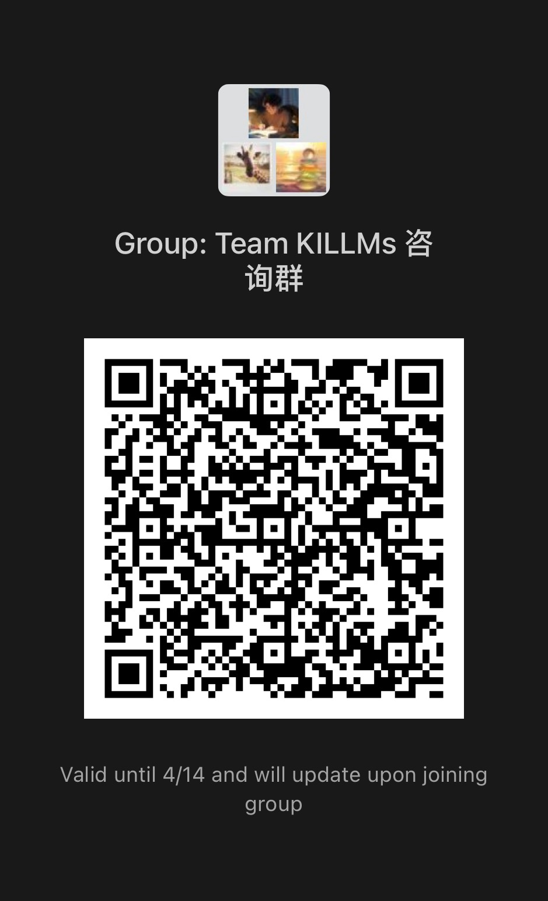

# 团队成员招募

## intro
- 我们是TCCI大模型及知识工程小组(KILLMs)，暂位于“博学楼之巅”，主要面向下一代人工智能垂直领域应用开发，是一支目标远大的探索型团队，目前团队支持两项工程级产品的算法开发，在研究阶段同时要求兼顾学术和工程两个主要部分。未来团队成员均具备良好的工程素养，不仅适合进一步深造，也适合进入互联网大厂淘金。我们的理念是“让你的亲人用上你的产品”。

## Agent大语言模型方向（3-4人）
有志于在有限的算力下挑战大模型的一系列开发和算法问题，了解NLP相关技术，理解大模型相关技术和挑战。
### 工程介绍
1. 实现大模型调用接口，特别是流式实现方式以及上下文压缩技术。
2. 使用SFT技术，构建不同比例语料库对大模型进行微调。
3. 使用Lora和量化技术对大模型进行微调。
4. RAG文档增强技术的使用。
5. CoT、ToT等提示词任务分解技术实现。
6. Langchain工具的调用与复现优化。
### 学术介绍
- 大模型相关技术在垂直领域的应用优化
- RLHF，强化学习技术在大模型优化上的应用
- 大模型在司法下游任务上的实现和提升
  
### 提供福利条件
1. 尽可能多的算力
2. 工程算法实现奖励
3. 免费的copilot pro
4. VR游戏设备+各种VR游戏
5. 团队水吧，可制作水果茶、牛奶咖啡、手冲咖啡、黑咖啡、冰咖啡
6. 阳光健身房，健身环，瑜伽垫，哑铃，杠铃，卧推椅，龙门架等
### 我们希望你是：
- 代码暴徒

## 数据挖掘与特征工程方向（3-4人）
有志于数据科学相关任务，了解爬虫技术，搜索引擎技术以及大规模数据中心用到的各种技术。
### 工程介绍
1. 编写爬虫工具有序爬取目标领域数据。
2. 分布式及分析型数据库搭建。
3. 使用分布式训练方法卸载算力到节点。
4. 向量数据库实现。
5. 众包任务平台实现。
6. K8S及docker容器化技术与大模型的运维开发。
7. 大模型压力测试以及负载均衡实现。
### 学术介绍
1. 下一代人工智能生产系统（运维大模型）
2. 知识图谱与大语言模型交互方法
3. 特征知识库构建与多模态数据检索
### 提供福利条件
1. 真实的快速的网络环境
2. 工程算法实现奖励
3. 免费的copilot pro
4. VR游戏设备+各种VR游戏
5. 团队水吧，可制作水果茶、牛奶咖啡、手冲咖啡、黑咖啡、冰咖啡
6. 阳光健身房，健身环，瑜伽垫，哑铃，杠铃，卧推椅，龙门架等
### 我们希望你是：
- 赛博强迫症

## 项目管理与产品设计工程师（1-2人）
有志于使用科学的管理思维，了解开发模式、原型设计以及人机体验优化等。
### 工程介绍
1. 熟练使用git工具管理各个项目代码。
2. 规划人月数开发，量化工程项目时间。
3. SOP分解并进行优化。
4. 原型设计及人机体验设计。
5. 开发日志自动化可视化分析，并按月给出团队项目优化建议。
### 学术介绍
- 数字资产管理研究
- 软件项目风险管理研究
- AI软件工程开发系统模式研究
### 提供福利条件
1. 多种桌游
2. 一套园丁工具，专业园艺教学指导
3. 专属GPT4账户
4. VR游戏设备+各种VR游戏
5. 团队水吧，可制作水果茶、牛奶咖啡、手冲咖啡、黑咖啡、冰咖啡
6. 阳光健身房，健身环，瑜伽垫，哑铃，杠铃，卧推椅，龙门架等
### 我们希望你是：
- 贵大乔布斯

